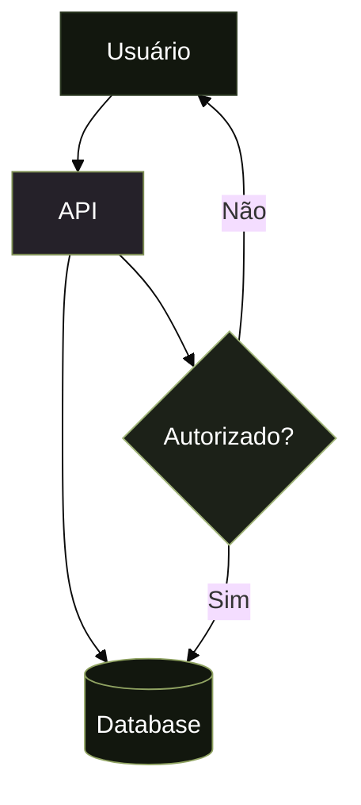

# C4 Design System — Regras Globais de Diagramas TomikCRM

**Status:** Ativo  
**Versão:** 3.0  
**Aplicação:** Todos os diagramas Mermaid no projeto NexusDocs AI

---

## Princípio

O objetivo não é estética genérica. É:

- identidade visual consistente da empresa
- leitura técnica clara
- sensação de sistema interno corporativo
- zero variação criativa fora do padrão

---

## Estrutura Obrigatória

```mermaid
%%{init: {'theme': 'base'}}%%
flowchart TD

classDef system    fill:#1C2118,stroke:#7C8D52,color:#FFFFFF
classDef container fill:#252129,stroke:#7C8D52,color:#FFFFFF
classDef database  fill:#12170E,stroke:#90A362,color:#FFFFFF
classDef decision  fill:#1C2118,stroke:#A0B478,color:#FFFFFF
classDef external  fill:#12170E,stroke:#2E3B24,color:#FFFFFF
```

---

## Paleta Oficial (brand.ts)

| Classe | Fill (token) | Stroke (token) | Uso |
|--------|--------------|----------------|-----|
| `system` | `#1C2118` `--surface` | `#7C8D52` `--accent` | Sistema central, núcleo, AI Engine |
| `container` | `#252129` `--card` | `#7C8D52` `--accent` | Apps, APIs, workers, serviços |
| `database` | `#12170E` `--bg` | `#90A362` `--muted` | Bancos de dados, stores, logs |
| `decision` | `#1C2118` `--surface` | `#A0B478` accent-high | Decisões, filas, roteadores |
| `external` | `#12170E` `--bg` | `#2E3B24` `--border` | Usuários, sistemas externos |

---

## Regras Obrigatórias

1. **`%%{init: {'theme': 'base'}}%%` sempre na primeira linha**
2. **`flowchart TD` sempre** — nunca `graph`, `LR`, `BT` ou outros tipos
3. **`:::classDef` inline em todo nó** — nunca `style <node>`
4. **Apenas as 5 classes acima** — nunca criar novas cores
5. **Todo nó deve ter classe** — nenhum nó sem atribuição
6. **Azul é proibido** — `#3B82F6` e similares não pertencem à marca

---

## Sintaxe Correta



---

## Proibições

```
%% PROIBIDO — azul ou cores externas à marca
classDef node fill:#0F172A,stroke:#3B82F6

%% PROIBIDO — inline style
style WA fill:#1D4ED8,color:#fff

%% PROIBIDO — nova classDef
classDef ai fill:#7C3AED,stroke:#8B5CF6,color:#FFFFFF

%% PROIBIDO — flowchart LR
flowchart LR
    A --> B

%% PROIBIDO — nó sem classe
A[Sistema]
```

---

## Templates Prontos

```ts
import { C4Templates } from '../components/diagrams/C4Template';

const base = C4Templates.context;    // C4 Level 1
const base = C4Templates.container;  // C4 Level 2
const base = C4Templates.component;  // C4 Level 3
const base = C4Templates.blank;      // Cabeçalho sem nós
```

---

## Checklist de Review

- [ ] Começa com `%%{init: {'theme': 'base'}}%%`
- [ ] Usa `flowchart TD`
- [ ] Tem os 5 `classDef` exatos (paleta TomikCRM)
- [ ] Nenhum azul (`#3B82F6` ou similar)
- [ ] Todo nó tem `:::system`, `:::container`, `:::database`, `:::decision` ou `:::external`
- [ ] Nenhum `style <node>` inline
- [ ] Nenhuma classDef extra criada
